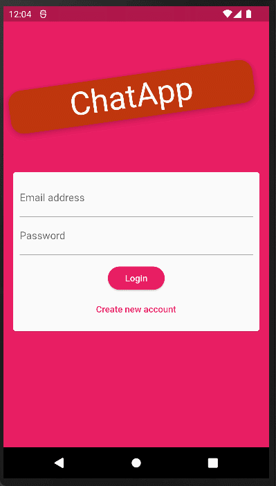

# chat_app

It is the simple chat_app with one public chatroom, where users are authenticated by email and password. Application stored messages,images and users data in **firebase** and was created in **Flutter** framework.

## Table of Contents
* [App Features](#app-features)
* [Presentation](#presentation)
* [Packages used in project](#packages-used-in-project)
* [Project Status](#project-status)
* [Sources](#sources)
* [Contact](#contact)

## App Features
- Sign Up by Email, Password and Username. 
- Add image of user. 
- Login Using Email and Password. 
- Send mesasages. 
- Read messages. 
- View of users image. 
- Pushnotification when messages are received.  

## Presentation

## Packages used in project:
- [Firebase Core](https://pub.dev/packages/firebase_core)
- [Firebase Auth](https://pub.dev/packages/firebase_auth)
- [Firebase Storage](https://pub.dev/packages/firebase_storage)
- [Firebase Messaging](https://pub.dev/packages/firebase_messaging)
- [Cloud Firestore](https://pub.dev/packages/cloud_firestore)
- [Image Picker](https://pub.dev/packages/image_picker)
  

## Project Status
The project is completed. However, I plan to add the ability to create your own chatroom with selected users in the future.

## Sources
The application was created during the course Flutter & Dart - The Complete Guide [2022 Edition] by Maximilian Schwarzmüller from Academind.

## Contact
Created by [@dbrzek](mailto:brzek.damian@gmail.com) - feel free to contact me!
